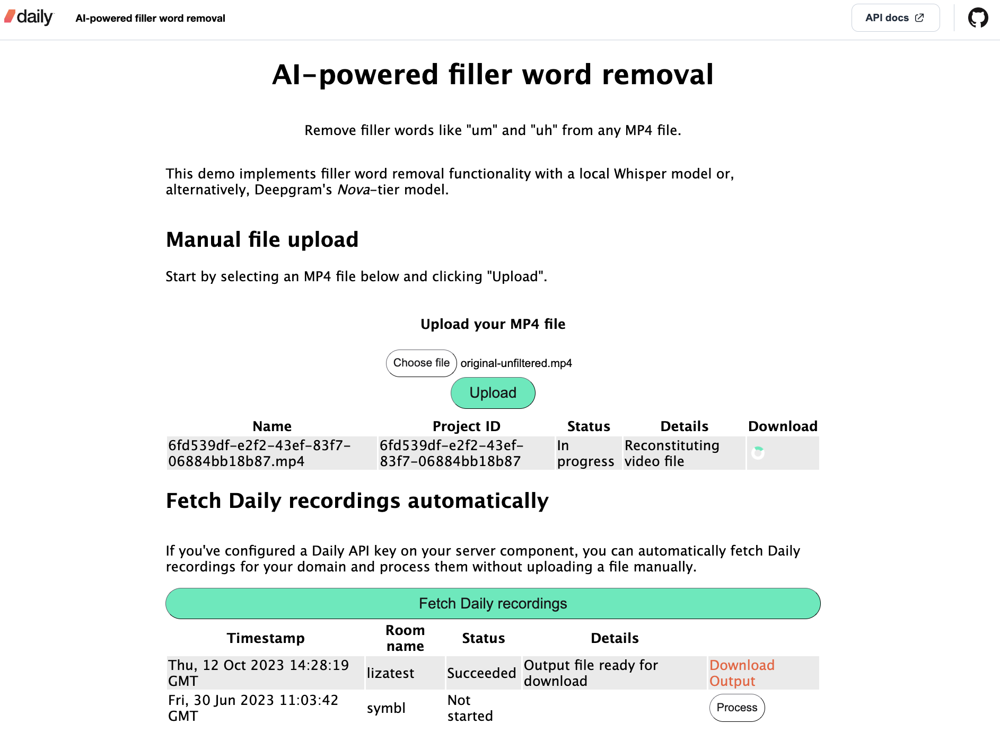

## Filler word removal with AI

This demo enables developers to remove filler words like "um" and "ah", also known as disfluencies, from their videos. You can either upload an MP4 of your choice to process or automatically retrieve Daily recordings from your domain to work on.

## Running the demo locally

This demo was tested with Python version 3.11.6. We recommend running this in a virtual environment.

### Set up your environment

Ensure that you have [FFmpeg](https://ffmpeg.org/) installed on your machine.

1. Clone this repository.
1. Copy the `.env.sample` file into `.env`. DO NOT submit your `.env` file to version control.
1. If you wish to use Deepgram instead of Whisper, paste your Deepgram API key into the `DEEPGRAM_API_KEY` environment variable in `.env`
1. If you wish to automatically retrieve Daily recordings for your domain instead of uploading an MP4 manually, paste your Daily API key into the `DAILY_API_KEY` environment variable in `.env`.

### Create and activate a virtual environment

In the root of the repository on your local machine, run the following commands:

1. `python3 -m venv venv`
1. `source venv/bin/activate`

### Run the application

In the virtual environment, run the following: 

1. Run `pip install -r requirements.txt` from the root directory of this repo on your local machine.
1. Run `quart --app server/index.py --debug run` in your terminal.
1. Run `python -m http.server --directory client` in another terminal window.

Now, open the localhost address shown in your terminal after the last step above. You should see the front-end of the demo allowing you to upload your MP4 file or fetch your Daily recordings:

If uploading a file manually, make sure the file is under 16MB in size. You can configure this server-side limit if you wish, but we stuck with Quart's default for this demo. 

## How it works

The demo consists of a small JavaScript client and a Python server, where the processing work is done.

When a video is uploaded or a Daily recording is chosen for processing, it is performed by the server as follows:

1. The MP4 file is saved to a designated upload directory.
2. Audio is extracted from the file and saved to a temporary folder.
3. The audio file is transcribed with all words timestamped in the returned data.
4. Start and end times for each recognized filler word are gathered.
5. Start and end times of all words _around_ the filler words are gathered.
6. The original video is split into multiple clips at the split points from step 5 above. This produces clips that do not include the detected filler words.
7. The clips are reconstituted into a new video file, which is saved into the designated output directory for the user to download.

Each step of the way, a status file is updated for the processing project, which the client pools repeatedly to check progress.

## Transcribers 

The demo implements two transcription models to choose from:

1. Whisper. This is an implementation that does not depend on any third-party APIs. The whisper model of choice is downloaded to the machine running the server component.
2. Deepgram. If a Deepgram API key is specified in your local `.env` file, the server will use Deepgram's Nova-tier model to detect filler words.

More models can be added by following the same interface as the above. Just place your implementation into `server/transcription/` and add your new transcriber to the `Transcribers` enum in `server/project.py`

## Caveats for production

### Storage

This demo utilizes the file system to store uploads, temporary clip files, and output. No space monitoring or cleanup is implemented here. To use this in a production environment, be sure to implement appropriate monitoring measures or use an external storage solution.

### Security

This demo contains no authentication features. Processed videos are placed into a public folder that anyone can reach, associated with a UUID. Should a malicious actor  guess or brute-force a valid project UUID, they can download processed output associated with that ID. For a production use case, access to output files should be gated.

### Error handling

This demo implements basic error handling in the form of writing errors to `stderr`. For a production use-case, appropriate logging and metrics should be added.